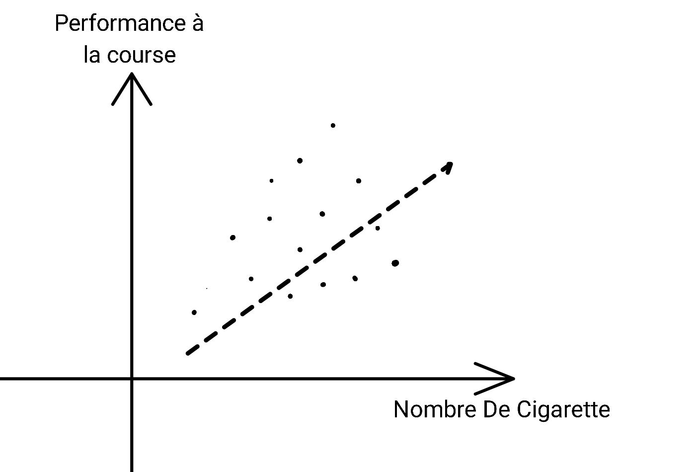
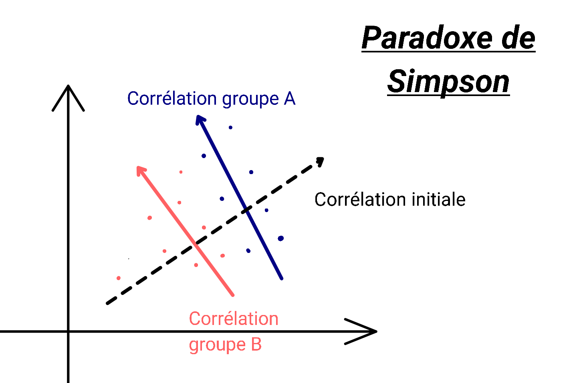

# Introduction: Graphe de causalité

On parle plus d'inférence causale en temps générale. Ceci étant dit, quézaco ?

L'inférence causale, selon wikipédia, est le processus par lequel on peut établir une relation de causalité entre un élément et ses effets. En claire, par le biais de formule nous déduisons qu'un évènnement en cause  un autre. Par exemple que le tabac cause le cancer du poumon. 

Elle peut servir dans de nombreux domaine, mon utilité par exemple est la root cause analysis. Elle est utile pour bien de chose, et apporte la part d'explicabilité manquants à nos modèles de machine learning.  

Un chose très connu dans le monde de la data science est la phrase "corrélation n'est pas causalité". Cette phrase est simplifié pour le plus grand nombre car dans certain cas que nous verrons cette phrase est fausse. 

## Le paradoxe de Simpson

Au délà du dessin animé qui a hanté mon enfance tous les soirs sur W9. 
C'est un paradoxe statistique décrit par George Udny Yule en 1903 et Edward Simpson en 1951 dont nous avons retenu le nom de ce dernier. 

Ce paradoxe est déroutant, en tous cas pour ce qui n'en n'ont pas l'habitude. 

Pour vous en parler, je vais vous prendre un exemple fictif issue d'une [vidéo arte à ce sujet](https://www.arte.tv/fr/videos/107398-002-A/voyages-au-pays-des-maths/). Un scientifique a souhaité mettre en évidence que fumé reduisait la performance des coureurs, le nuage de point représente ces résulats, en x le nombre de cigarette, en y la performance en temps sur 100 mètre. Notre hypothèse: "Plus le nombre de cigarette est grand, plus nous perdons en performance".

Le résultat est surprenant ! Selon le graphique plus nous fumons plus nous devenons performant à la course. Ah marlboro et ces études avait raisons, le tabac est belle et bien bénéfique pour la santé *(second degrès pour ceux qui l'aurai pas deviné)*.

En faite, il s'avère qu'une variable n'a pas été pris en compte.

Donc arreter tous de suite de fumer, en faite notre raisonnement était juste ! Le tabac diminue belle et bien performance si nous distinguons le groupe A (qui sont les garçons dans la vidéo) du groupe B (les filles).

L'explication du graphique est très dépendantes de son contexte. Ici nous avons des adolescents, les garçons ont **plus souvent** des comportements à risque donc fume plus facilement et plus que les filles. Par les différences physiologiques, avoir plus de testosterons permet de gagner plus en muscule chez les garçons que les filles donc nous obtenons ces résultats !

Le paradoxe de Simpson est un phénomène observé dans plusieurs groupes qui s'inverse lorsque les groupes sont combinés. J'espère vous avoir convaincu que **la corrélation n'est pas causalité**. 

Allez super, bientot nous allons voir le contraire ! 

## Quelle conséquences sur l'inférence causale ?

Dans l'inférence causale, il y a deux termes qui se distingue:
- **Inférence** qui rejoint nos statistiques. Celle qui permettent de valider ou non nos hypothèses d'association des variables. 
- **Causale** qui elle se dirige plus autour des graphes (DAG plus précisément pour ce domaine) et fournit une arborescence de lien de cause à effet.

C'est simple lorsque nous calculerons nos corrélations, de nombreux biais seront à prendre en compte dans nos formules. Les statisticiens le voit surement arrivés, le fameux P(Y | X=x). Celui qui permet de trouver la probabilité issue de nos statistiques*

*J'espère que vous etes à l'aise avec la différence statistique ou probabilité. Probablement non si vous lisez ça, bref j'hesite à faire duré. Trève de plaisanterie, la statistique c'est calculé pour nos échantillons* comme la moyenne, l'écart type qu'on appelle estimateur. On se base sur les statistiques pour faire nos probabilité, les probabilités permettent de déduire, par exemple qu'elle est la chance d'avoir une femme dans l'association "les bleus", bah 0.35 car on a noté qu'il y avait 35 femmes sur 100 personnes dans cette association, donc nous avons 35 % de femme, notre stats, ainsi on a 0.35 % de chance d'avoir une femme, ce qu'on cherche à pédire par notre probas.  

*J'espère que ça va aussi pour le mots échantillons, sinon je peux expliquer ? Bon bah expliquons, un echantillon est une partie d'une population (on dit qu'il est représentatif s'il a les memes caractéristiques que sa population, meme taux d'ingénieur, de femme et d'homme, etc..).   

---

# Introduction : Graphe de causalité

On parle souvent d'inférence causale en général. Mais qu'est-ce que cela signifie exactement ?  

L'inférence causale, selon Wikipédia, est le processus par lequel on établit une relation de causalité entre un élément et ses effets. En clair, à l'aide de formules, nous déduisons qu'un événement en cause un autre. Par exemple, que le tabac cause le cancer du poumon.  

Elle est utile dans de nombreux domaines. Mon cas d'utilisation, par exemple, est l'**analyse des causes profondes** (*Root Cause Analysis*). L'inférence causale apporte une dimension explicative souvent manquante à nos modèles de machine learning.  

Une phrase bien connue dans le monde de la data science est **"corrélation n'est pas causalité"**. Cette phrase est une simplification, car, dans certains cas que nous verrons, elle peut s'avérer fausse.  

---

## Le paradoxe de Simpson

Au-delà du dessin animé qui a marqué mon enfance tous les soirs sur W9, **le paradoxe de Simpson** est un paradoxe statistique décrit par George Udny Yule en 1903 et Edward Simpson en 1951, dont nous avons retenu le nom de ce dernier.  

Ce paradoxe est déroutant, en tout cas pour ceux qui n'en ont pas l'habitude.  

Prenons un exemple fictif issu d'une [vidéo Arte sur le sujet](https://www.arte.tv/fr/videos/107398-002-A/voyages-au-pays-des-maths/). Un scientifique cherche à montrer que fumer réduit la performance des coureurs. Il représente ses résultats sous forme d'un nuage de points :  
- En abscisse (*x*), le nombre de cigarettes fumées.  
- En ordonnée (*y*), le temps de course sur 100 mètres.  

Notre hypothèse : **"Plus le nombre de cigarettes fumées est élevé, plus nous perdons en performance."**  

  

Le résultat est surprenant ! Selon le graphique, plus nous fumons, plus nous devenons performants à la course. Ah, Marlboro et ses études avaient raison : le tabac est bel et bien bénéfique pour la santé... *(second degré pour ceux qui ne l'auraient pas deviné)*.  

En réalité, une variable essentielle n’a pas été prise en compte.  

  

Donc **ne commencez surtout pas à fumer !** En fait, notre raisonnement initial était correct : **le tabac diminue bien la performance**, mais il faut distinguer le groupe A (les garçons) du groupe B (les filles).  

L'explication du graphique dépend fortement de son contexte. Ici, nous avons affaire à des adolescents :  
- Les garçons ont **plus souvent** des comportements à risque, donc ils fument plus que les filles.  
- Par différences physiologiques, la testostérone favorise davantage le développement musculaire chez les garçons que chez les filles, ce qui améliore leurs performances en course.  

Ainsi, ce paradoxe illustre bien un phénomène où **les tendances observées dans plusieurs groupes s’inversent lorsque ces groupes sont combinés**. J’espère vous avoir convaincu que **corrélation n’est pas causalité** !  

Mais surprise : bientôt, nous verrons le contraire...  

---

## Quelles conséquences sur l'inférence causale ?  

En inférence causale, deux notions doivent être distinguées :  
- **Inférence** : concept statistique permettant de valider ou non nos hypothèses d’association entre variables.  
- **Causalité** : approche basée sur des graphes causaux (*DAG*), qui fournit une arborescence des relations de cause à effet.  

Lorsque nous calculons des corrélations, **de nombreux biais doivent être pris en compte** dans nos formules. Les statisticiens voient venir le fameux **P(Y | X = x)**, qui exprime la probabilité d’un événement donné nos observations statistiques.  

*J’espère que vous êtes à l’aise avec la différence entre statistique et probabilité... Probablement non, si vous lisez ceci. Bref, j’hésite à prolonger... Trêve de plaisanterie !
- **Les probabilités :** elles partent d’un modèle théorique pour prédire des événements futurs. Elles répondent à la question :
"Si je connais les lois du jeu, quelles sont les chances d’obtenir tel ou tel résultat ?".
Exemple : Si je lance un dé équilibré, quelle est la probabilité d’obtenir un 6 ?
- **Les statistiques :** elles partent des données observées pour en extraire des tendances et tirer des conclusions sur une population. Elles répondent à la question :
"À partir des données récoltées, quelles sont les régularités que l'on peut observer ?".
Exemple : Si j’observe 1000 lancers d’un dé, et que j’obtiens un 6 dans 18 % des cas, je peux en déduire que mon dé est probablement biaisé.

Pour résumer:
- En probabilité, on connaît le modèle et on prédit les résultats possibles.
- En statistique, on observe les résultats et on essaie d’inférer le modèle sous-jacent.
-> # TODO: revoir via wikipédia
*(Si le mot "échantillon" vous pose problème, voici une explication rapide : un échantillon est une **partie** d’une population. Il est représentatif s’il possède les mêmes caractéristiques que cette population — même taux d’ingénieurs, de femmes, d’hommes, etc.)
